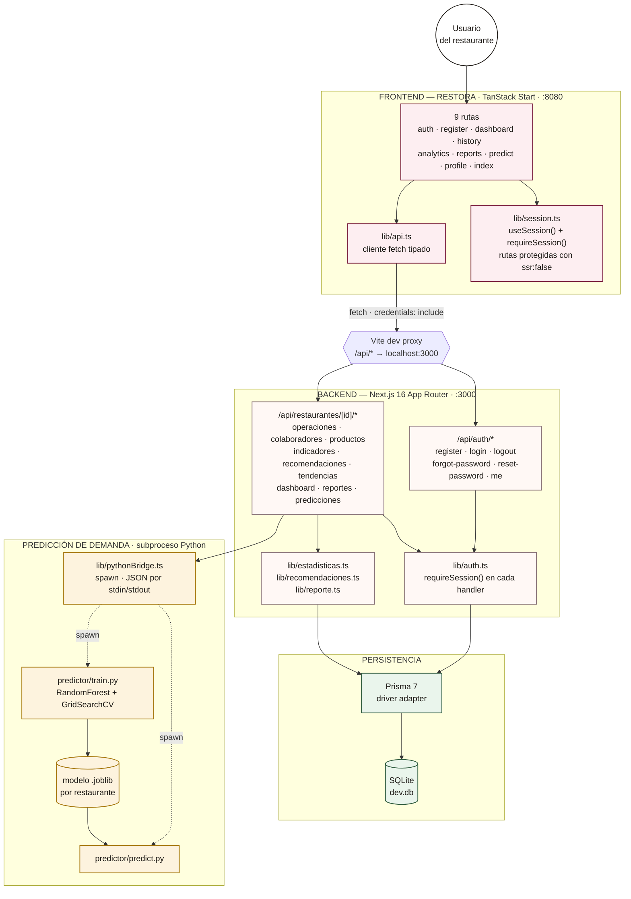

# RESTORA / CircularAQP — Arquitectura del sistema

Monorepo con tres piezas: un frontend TanStack Start que habla con una API REST en Next.js
por un proxy de desarrollo, persistencia en SQLite vía Prisma, y un modelo de predicción de
demanda en Python invocado como subproceso desde Node.

**Stack**: Next.js 16 (App Router) · TanStack Start + React Query · Prisma 7 + SQLite · Python / scikit-learn (RandomForest) · Sesión JWT en cookie httpOnly.

## Componentes y flujo de datos



**Leyenda**: rosa = frontend · crema = backend/API · verde = persistencia · dorado = modelo predictivo. Línea sólida = llamada HTTP/JSON · línea punteada = `spawn` de subproceso.

## Ciclo de una petición protegida

1. El navegador llama `fetch("/api/...")` con `credentials: include` desde `lib/api.ts`.
2. El proxy de Vite reenvía todo `/api/*` a `localhost:3000` — mismo origen para el navegador, así la cookie de sesión viaja sin fricción de CORS.
3. El route handler llama `requireSession(request, restauranteId)`: valida el JWT y que la sesión pertenece a ese restaurante.
4. La lógica de negocio corre — Prisma para datos, o `pythonBridge.ts` si la ruta es de predicciones.
5. La respuesta JSON vuelve por el mismo camino; React Query cachea y re-renderiza.

## Estructura del repositorio

```
turiston-project/              # backend Next.js (raíz)
├── src/app/api/                rutas REST
├── src/lib/                    sesión, reglas, cliente Python
├── prisma/                     schema + seed
├── predictor/                  train.py · predict.py · common.py
│   └── models/                 *.joblib por restaurante (gitignored)
└── frontend/                   TanStack Start (app aparte)
    └── src/routes/              9 pantallas
```

---
CircularAQP — TURISTÓN 2026 · Hackathon de Innovación Turística, Arequipa
